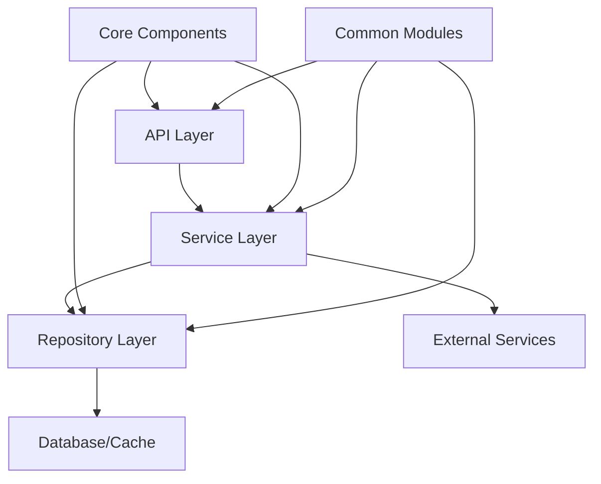
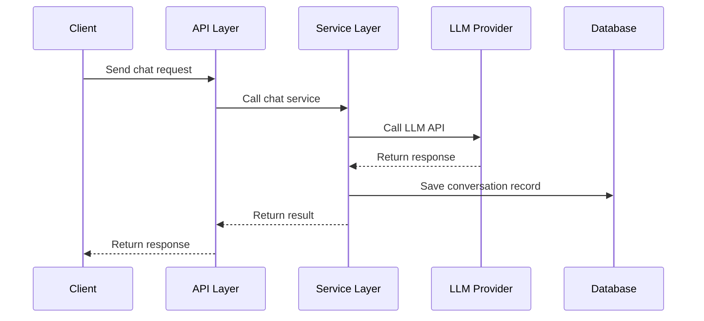

# 经纬（JingWei）

<div align="center">


**Production Grade LLM Application Development Platform**

Production Grade Visual Workflow Orchestration Platform

[Quick Start](#quick-start) · [Documentation](https://gitee.com/yeyushilai/x-jingwei) · [Examples](#examples) · [Contributing](#contributing)

</div>

## Project Introduction

X-JingWei (经纬) is a production-grade visual workflow orchestration platform built with FastAPI and React. It provides a standardized, modular, highly scalable, and maintainable infrastructure for building LLM-powered applications.

## Core Features

- **Layered Architecture**: Clear API, Service, Repository three-layer architecture
- **Dependency Injection**: Built-in Go Wire-style dependency injection container
- **Standardized Response**: Unified API response format and error handling
- **Complete Logging**: Structured logging system based on loguru
- **Dual Configuration System**: Supports both .env environment variables and YAML configuration files
- **Middleware Support**: CORS, rate limiting, request tracing, and more
- **Async Support**: Full async architecture based on FastAPI
- **Production-Grade Code**: Complete type annotations, docstrings, and unit tests

## Project Structure

```
x-jingwei/
├── config/                 # Configuration files directory
│   ├── config.yaml         # Main configuration file
│   └── .env.example        # Environment variable example
├── docs/                   # Project documentation
├── examples/               # Usage examples
│   ├── llm_chat.py         # LLM chat example
│   ├── document_upload.py  # Document upload example
│   ├── config_example.py   # Configuration management example
│   └── dependency_injection.py  # Dependency injection example
├── scripts/                # Deployment scripts
│   ├── start.sh            # Linux startup script
│   ├── start.ps1           # Windows startup script
│   ├── test.sh             # Linux test script
│   ├── test.ps1            # Windows test script
│   ├── lint.sh             # Linux lint script
│   └── lint.ps1            # Windows lint script
├── src/                    # Core business code
│   ├── api/                # API layer
│   │   ├── v1/             # API v1 version
│   │   │   ├── health.py   # Health check
│   │   │   ├── version.py  # Version info
│   │   │   ├── llm.py      # LLM endpoints
│   │   │   └── document.py # Document endpoints
│   │   └── router.py       # Route management
│   ├── common/             # Common modules
│   │   ├── constants.py    # Global constants
│   │   ├── response.py     # Response standardization
│   │   └── schemas.py      # Data models
│   ├── core/               # Core modules
│   │   ├── config.py       # Configuration management
│   │   ├── logger.py       # Logging management
│   │   ├── exceptions.py   # Exception definitions
│   │   ├── container.py    # Dependency injection container
│   │   └── middleware.py   # Middleware
│   ├── models/             # Data models
│   │   ├── base.py         # Base classes
│   │   ├── document.py     # Document models
│   │   └── llm.py          # LLM models
│   ├── repositories/       # Data access layer
│   │   └── document_repository.py
│   ├── services/           # Business logic layer
│   │   ├── llm_service.py  # LLM service
│   │   └── document_service.py
│   ├── utils/              # Utility functions
│   │   ├── helpers.py      # Helper functions
│   │   └── validators.py   # Validators
│   └── main.py             # Application entry point
├── tests/                  # Test cases
│   ├── conftest.py         # Test configuration
│   ├── test_config.py      # Configuration tests
│   ├── test_utils.py       # Utility tests
│   └── test_api.py         # API tests
├── .gitignore              # Git ignore file
├── .python-version         # Python version
├── Dockerfile              # Docker configuration
├── docker-compose.yml      # Docker Compose configuration
├── LICENSE                 # MIT License
├── pyproject.toml          # Project configuration
└── README.md               # Project documentation
```

## System Architecture

### Layered Architecture



### LLM Conversation Flow



## Quick Start

### Requirements

- Python 3.11 or higher
- uv package manager

#### Windows

1. Install Python 3.11+
   ```powershell
   # Download from python.org or use winget
   winget install Python.Python.3.11
   ```

2. Verify Python version
   ```powershell
   python --version
   ```

#### Linux/macOS

1. Install Python 3.11+
   ```bash
   # Ubuntu/Debian
   sudo apt update
   sudo apt install python3.11 python3.11-venv

   # macOS
   brew install python@3.11
   ```

2. Verify Python version
   ```bash
   python3.11 --version
   ```

### Clone Project

```bash
git clone https://gitee.com/yeyushilai/x-jingwei.git
cd x-jingwei
```

### Install Dependencies

```bash
# Install uv (if not already installed)
curl -LsSf https://astral.sh/uv/install.sh | sh

# Or install using Python
python -m pip install uv

# Install project dependencies
uv pip install -e .
```

### Configuration

1. Copy environment variable example file
   ```bash
   cp config/.env.example config/.env
   ```

2. Edit `.env` file, configure necessary environment variables
   ```bash
   # LLM configuration
   DEEPSEEK_API_KEY=your_api_key_here
   ```

3. For custom configuration, edit `config/config.yaml`

### Service Startup

#### Local Development Mode (Hot Reload and Debugging)

##### Windows

```powershell
# Start using script
.\scripts\start.ps1 --reload

# Or use uvicorn directly
uvicorn src.main:app --host 0.0.0.0 --port 8000 --reload
```

##### Linux/macOS

```bash
# Start using script
./scripts/start.sh --reload

# Or use uvicorn directly
uvicorn src.main:app --host 0.0.0.0 --port 8000 --reload
```

#### Docker Deployment

```bash
# Build image
docker-compose build

# Start service
docker-compose up -d

# View logs
docker-compose logs -f x-jingwei
```

### Common Commands

```bash
# Run tests
pytest tests/ -v

# Run tests with coverage report
pytest tests/ --cov=src --cov-report=html

# Code formatting
black src/ tests/ examples/

# Code linting
ruff check src/ tests/ examples/

# Type checking
mypy src/
```

## Technology Stack

### Web Framework
- **FastAPI**: Modern, high-performance web framework
- **Uvicorn**: ASGI server
- **Pydantic**: Data validation and serialization

### Data Storage
- **SQLite**: Lightweight database (default)
- **PostgreSQL**: Production database (optional)
- **Redis**: Cache service (optional)

### Utilities
- **loguru**: Logging management
- **PyYAML**: YAML configuration parsing
- **python-dotenv**: Environment variable management
- **httpx**: Async HTTP client
- **slowapi**: Rate limiting middleware

### Deployment Tools
- **Docker**: Containerization
- **Docker Compose**: Multi-container orchestration

## API Documentation

After starting the service, access the API documentation at:

- **Swagger UI**: http://localhost:8000/docs
- **ReDoc**: http://localhost:8000/redoc
- **OpenAPI JSON**: http://localhost:8000/openapi.json

### Main Endpoints

#### Health Check
```bash
GET /api/v1/health
```

#### Version Info
```bash
GET /api/v1/version
```

#### LLM Chat
```bash
POST /api/v1/llm/chat
Content-Type: application/json

{
  "messages": [
    {"role": "user", "content": "Hello"}
  ],
  "temperature": 0.7,
  "max_tokens": 200
}
```

#### Document Upload
```bash
POST /api/v1/documents/upload
Content-Type: multipart/form-data

file: example.txt
chunk_size: 500
chunk_overlap: 50
```

## Storage Configuration

### Local Storage

- **Log files**: `logs/app.log`
- **Data files**: `data/`
- **Vector storage**: `data/vector_store/`

### Object Storage (Planned)

Future support for S3, OSS, and other object storage services.

## License

This project is licensed under the [MIT License](LICENSE).

## References

- [FastAPI Documentation](https://fastapi.tiangolo.com/)
- [Python Documentation](https://docs.python.org/3.11/)
- [Pydantic Documentation](https://docs.pydantic.dev/)
- [Uvicorn Documentation](https://www.uvicorn.org/)
- [uv Documentation](https://github.com/astral-sh/uv)

## Contact

- **Author**: 夜雨诗来
- **Email**: john.young@foxmail.com
- **Gitee**: https://gitee.com/yeyushilai
- **GitHub**: https://github.com/yeyushilai

## Contributing

Issues and Pull Requests are welcome!